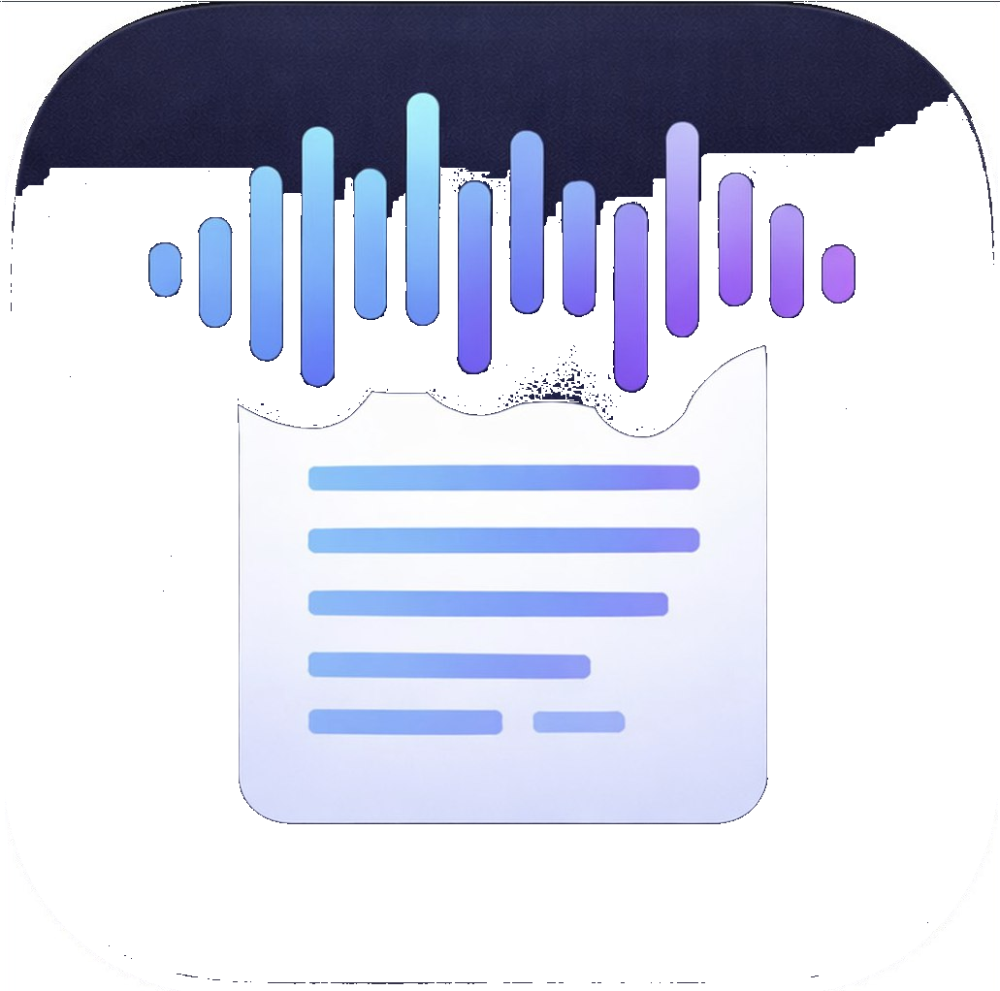

# Whisper Smart (macOS)

Whisper Smart is a lightweight macOS menu-bar dictation app that supports local speech-to-text workflows.

## Smart model presets

In **Settings → Provider**, the app now includes explicit model presets:
- **Light**: Whisper Tiny/Base (local, fastest setup)
- **Balanced**: Parakeet TDT 0.6B v3 ONNX source (experimental)
- **Best**: Whisper Large-v3 Turbo (local quality-focused)
- **Cloud**: OpenAI Whisper API

If the selected provider is missing runtime/model files, the app degrades gracefully to Apple Speech and shows direct install/download actions in the same settings screen.

Cloud API keys are normalized on paste/save and stored in macOS Keychain when available (with safe fallback handling for constrained environments).
Cloud endpoint profile is configurable (official OpenAI or OpenAI-compatible gateway), including custom base URL + model.

Whisper and Parakeet setup is managed in-app (runtime + model downloads), but host prerequisites still apply: Apple Command Line Tools are required for local builds, `make` is required for Whisper runtime build, and Python 3 with `venv` support is required for Parakeet runtime bootstrap. The app now fails fast with actionable guidance when these are missing.

## App icon



## Download

- Grab the latest DMG from **GitHub Releases**.
- Open the DMG and drag **Whisper Smart.app** into **Applications**.

```bash
bash scripts/package_dmg.sh
```

Output:

- `.build/release/Whisper-Smart-mac.dmg`

## Verification

```bash
bash scripts/run_qa_smoke.sh
bash scripts/run_visual_regression.sh
bash scripts/qa_latency_report.sh
bash scripts/run_app_compatibility_matrix.sh
bash scripts/typecheck.sh
bash scripts/swift_test_check.sh
bash scripts/release_gate.sh
```

`swift_test_check.sh` intentionally skips `swift test` when no SwiftPM tests exist under `Tests/` and reports that decision explicitly to avoid false failures.

## Phase Execution Roadmap

- 5-phase execution tracker: `docs/PHASE_EXECUTION_ROADMAP.md`
- Phase 5 QA + release checklist: `docs/PHASE5_QA_RELEASE_READINESS.md`
- Release checklist: `docs/RELEASE_CHECKLIST.md`
- Provider/performance plan: `docs/PERF_AND_PROVIDER_EXPANSION_PLAN.md`

## GitHub Automation

- CI validation workflow: `.github/workflows/macos-ci.yml`
- Manual DMG release workflow: `.github/workflows/release-dmg.yml` (runs full release gate + includes rollback reference)

## Notes

For broad public distribution, use Apple Developer ID signing + notarization to avoid Gatekeeper warnings.
